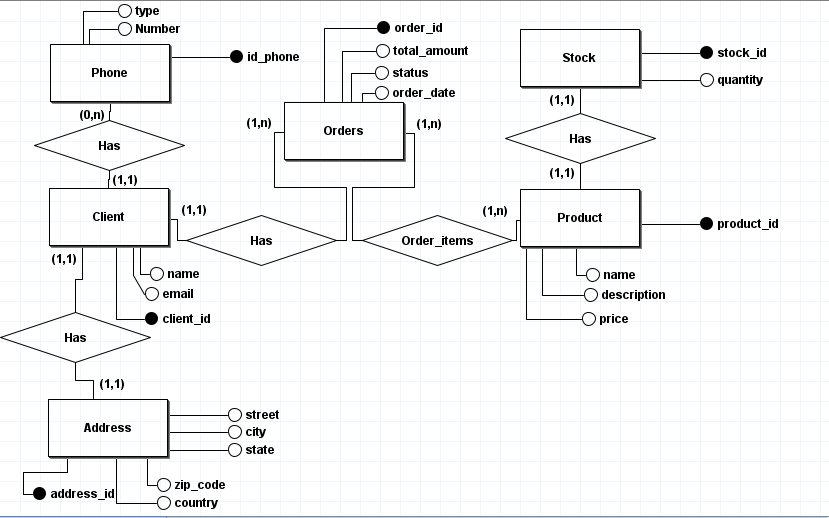
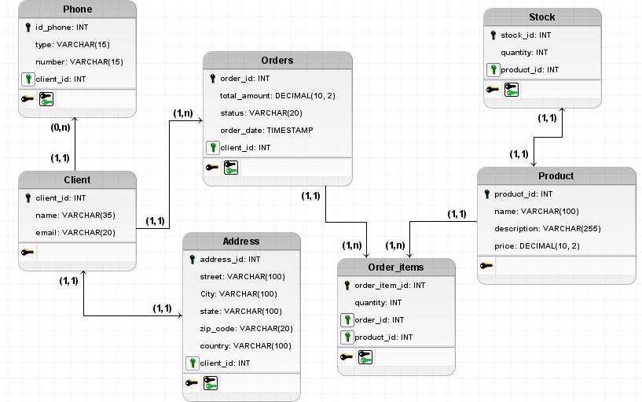

# Documentação da Estrutura do Banco de Dados

Este documento descreve a estrutura do banco de dados para o sistema de gerenciamento de clientes e pedidos, incluindo como a normalização foi aplicada para garantir a eficiência e integridade dos dados. A estrutura segue as três primeiras formas normais (1NF, 2NF, e 3NF).

## Estrutura das Tabelas

### Tabela: `PHONE`
Armazena informações sobre os números de telefone dos clientes.
- **id_phone**: `INT` (PK) - Identificador único do telefone.
- **type**: `VARCHAR(15)` - Tipo de telefone (ex: celular, fixo).
- **number**: `VARCHAR(15)` - Número de telefone.
- **client_id**: `INT` (FK) - Identificador do cliente relacionado.

### Tabela: `Client`
Armazena informações sobre os clientes.
- **client_id**: `INT` (PK) - Identificador único do cliente.
- **name**: `VARCHAR(35)` - Nome do cliente.
- **email**: `VARCHAR(20)` - Email do cliente.

### Tabela: `Address`
Armazena informações sobre os endereços dos clientes.
- **address_id**: `INT` (PK) - Identificador único do endereço.
- **street**: `VARCHAR(100)` - Rua do endereço.
- **city**: `VARCHAR(100)` - Cidade do endereço.
- **state**: `VARCHAR(100)` - Estado do endereço.
- **zip_code**: `VARCHAR(20)` - CEP do endereço.
- **country**: `VARCHAR(100)` - País do endereço.
- **client_id**: `INT` (FK) - Identificador do cliente relacionado.

### Tabela: `Orders`
Armazena informações sobre os pedidos realizados.
- **order_id**: `INT` (PK) - Identificador único do pedido.
- **total_amount**: `DECIMAL(10, 2)` - Valor total do pedido.
- **status**: `VARCHAR(20)` - Status do pedido (ex: pendente, concluído).
- **order_date**: `TIMESTAMP` - Data e hora do pedido.
- **client_id**: `INT` (FK) - Identificador do cliente que realizou o pedido.

### Tabela: `Order_items`
Armazena informações sobre os itens de cada pedido.
- **order_item_id**: `INT` (PK) - Identificador único do item do pedido.
- **quantity**: `INT` - Quantidade do produto.
- **order_id**: `INT` (FK) - Identificador do pedido.
- **product_id**: `INT` (FK) - Identificador do produto.

### Tabela: `Product`
Armazena informações sobre os produtos disponíveis.
- **product_id**: `INT` (PK) - Identificador único do produto.
- **name**: `VARCHAR(100)` - Nome do produto.
- **description**: `VARCHAR(255)` - Descrição do produto.
- **price**: `DECIMAL(10, 2)` - Preço do produto.

### Tabela: `Stock`
Armazena informações sobre o estoque dos produtos.
- **stock_id**: `INT` (PK) - Identificador único do estoque.
- **quantity**: `INT` - Quantidade disponível no estoque.
- **product_id**: `INT` (FK) - Identificador do produto.

## Aplicação das Formas Normais

### Primeira Forma Normal (1NF)

Todas as tabelas seguem a Primeira Forma Normal, garantindo que cada coluna contenha valores atômicos e indivisíveis. Por exemplo:
- A tabela `Orders` armazena apenas um pedido por linha.
- A tabela `Order_items` armazena um item por linha, sem dados repetidos dentro de uma única célula.

### Segunda Forma Normal (2NF)

Para estar na Segunda Forma Normal, as tabelas foram ajustadas para garantir que todos os atributos não-chave dependam completamente da chave primária:
- Na tabela `Order_items`, o atributo `quantity` depende da combinação de `order_id` e `product_id`, eliminando a dependência parcial.
- A tabela `Product` armazena informações completas sobre o produto e não repete dados da tabela `Order_items`.

### Terceira Forma Normal (3NF)

Para estar na Terceira Forma Normal, eliminamos as dependências transitivas:
- A tabela `Orders` não contém atributos que dependem de outros atributos não-chave, apenas da chave primária `order_id`.
- A tabela `Product` armazena informações sobre produtos sem dependências adicionais de outras tabelas, mantendo os dados diretos e simples.

## Sugestões de Índices

Para melhorar o desempenho das consultas, considere adicionar os seguintes índices:

- **Índices na Tabela `PHONE`**
  - Índice na coluna `client_id` para consultas que buscam telefones por cliente.

- **Índices na Tabela `Address`**
  - Índice na coluna `client_id` para consultas que buscam endereços por cliente.

- **Índices na Tabela `Orders`**
  - Índice na coluna `client_id` para consultas que buscam pedidos por cliente.
  - Índice na coluna `order_date` para consultas por data do pedido.

- **Índices na Tabela `Order_items`**
  - Índice na coluna `order_id` para consultas que buscam itens por pedido.
  - Índice na coluna `product_id` para consultas que buscam itens por produto.

- **Índices na Tabela `Stock`**
  - Índice na coluna `product_id` para consultas que buscam estoque por produto.

## Modelos Conceitual e Lógico

